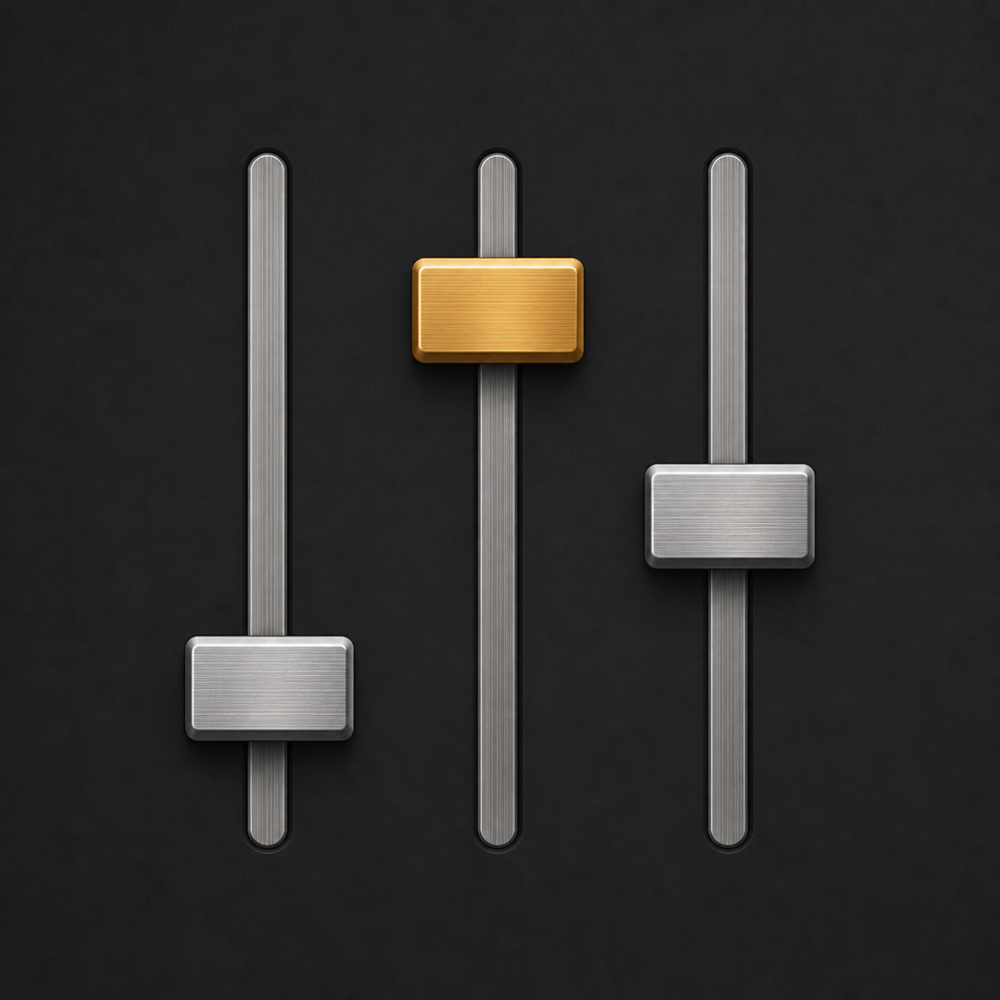
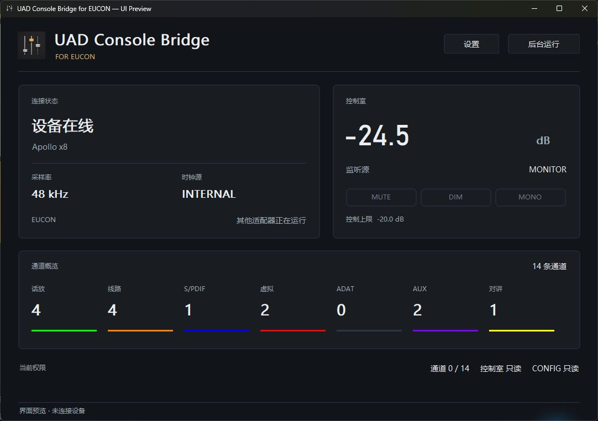

# UAD Console Bridge for EUCON

Control the UAD Console DSP mixer from an Avid EUCON surface or Avid Control.

**[Download v1.0.0](https://github.com/lindelea/uad-console-bridge-eucon/releases/latest)**

No build tools are required. Download the installer and use your existing UAD and EUCON setup.

[简体中文使用手册](docs/USER_GUIDE.zh-CN.md) ・ [English User Guide](docs/USER_GUIDE.en.md) ・ [日本語ユーザーガイド](docs/USER_GUIDE.ja.md)

The bridge exposes Apollo channels, sends, plug-ins, preamps and the control room as a dedicated EUCON application. Continuous audio controls and meter feedback are handled in real time; UAD Console and Apollo continue to process the audio.

## UAD Console control from Avid S3 and Avid Control

- Mix Apollo Console channels from a EUCON control surface.
- Operate sends, preamps, UAD plug-ins, UNISON, and CONFIG pages.
- Control the monitor section, DIM, MONO, source, and talkback.
- Switch EUCON focus between UAD Console control and a DAW without sharing control state.

Requirements: Windows 11 x64, a working Apollo/UAD Console installation, and Avid EuControl / EUCON Workstation 2026.4. Tested with Apollo, Avid S3 and Avid Control.

This repository is for downloads and user documentation. The corresponding v1.0.0 source is available in the [development project](https://github.com/lindelea/windows-fader-bridge/tree/v1.0.0). Licensed under [MPL 2.0](LICENSE). This independent project is not affiliated with or endorsed by Universal Audio or Avid.
