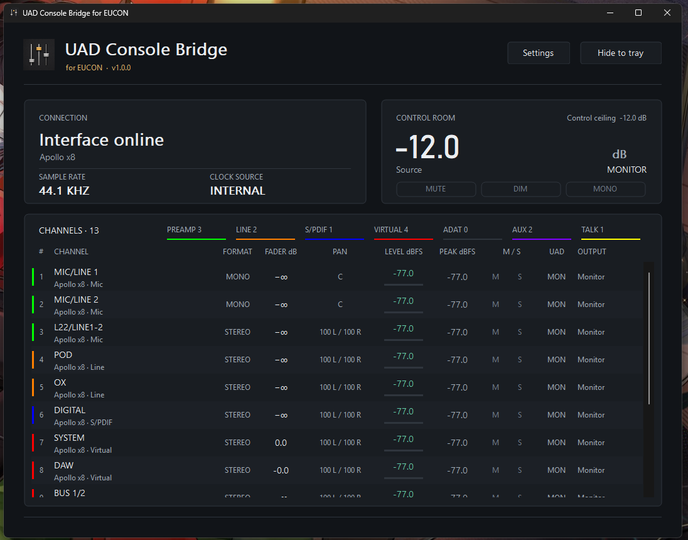
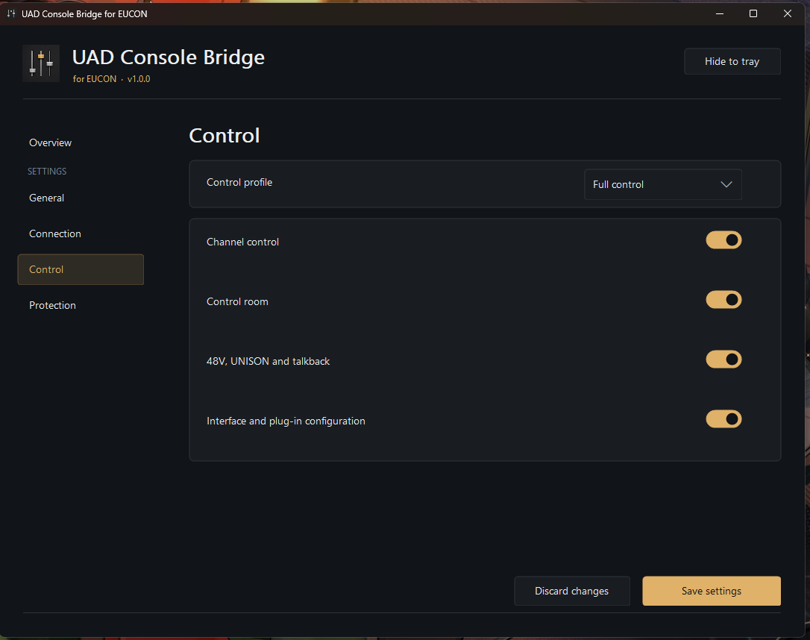

# UAD Console Bridge for EUCON 使用手册

[English](USER_GUIDE.en.md) ・ [日本語](USER_GUIDE.ja.md) ・ [返回主页](../README.md)

## 它能做什么

本程序把 UAD Console 中的 Apollo DSP 混音器作为独立 EUCON 应用发布到 Avid 控制台。你可以控制通道推子、声像、Mute、Solo、发送、输入前级、已加载插件和控制室，并在控制台上看到名称、参数数值、推子、电平和状态反馈。

音频仍由 Apollo DSP 和 UAD Console 处理。本程序只负责实时控制与反馈，不替代 Console，不改变音频驱动。

## 使用前准备

- Windows 11 64 位。
- Apollo 与 UAD Console 已安装并能正常工作；请先确认 Console 自己可以看到声卡和电平。
- Avid EuControl / EUCON Workstation 2026.4 已安装并正常运行。
- EuControl 中已连接兼容 EUCON 控制台，或装有 Avid Control 的平板。

## 安装

1. 在 [Releases](https://github.com/lindelea/uad-console-bridge-eucon/releases/latest) 下载名称以 `Setup-x64.exe` 结尾的安装程序。
2. 退出以前手动运行的便携版，双击安装程序并完成安装。
3. 从开始菜单打开 **UAD Console Bridge for EUCON**。

本项目暂未购买 Windows 代码签名证书，因此 Windows 可能显示“未知发布者”。请只从本仓库下载，并可使用发布页中的 SHA-256 校验值核对文件。

## 第一次连接

1. 启动 UAD Console，确认 Apollo 在线。
2. 启动 EuControl，确认控制台在线。
3. 启动本程序。总览页出现声卡、采样率和通道后，说明已读到 Console；EUCON 状态就绪后即可控制。
4. 在设置中选择需要的控制范围并保存。驱动重装后如果 Apollo 被 Windows 识别为新设备，只需重新应用一次控制范围，不必重装本程序。
5. 按 `Ctrl+Alt+Shift+U` 可把本程序调到前台并让 EuControl 识别为当前应用。是否识别后回到后台由设置决定。

三个相关应用可以同时运行，默认快捷键互不冲突：Windows EUCON 为 `Ctrl+Alt+Shift+W`，UAD EUCON 为 `Ctrl+Alt+Shift+U`，Mackie Control 为 `Ctrl+Alt+Shift+M`。也可以在 EuControl Soft Keys 中分配 **Windows EUCON** 与 **UAD EUCON** 命令。

程序会自动等待启动较慢的 UAD Mixer Engine 和 EUCON 服务，因此开机启动顺序不是硬性要求。

## 通道控制

- 推子：通道音量，实时发送并由 Console 状态校正。
- Pan：单声道通道为普通声像；立体声通道保留左右两个声像。按下对应旋钮回到中心。
- Mute / Solo：切换并显示 Console 的实际状态。
- Sends / Cues：调整支持的发送量与声像，显示 dB 等工程单位。
- Input / Preamp：控制当前通道支持的增益、输入、PAD、48V、相位、HPF 等项目。
- Inserts / UNISON：控制已经加载的插件参数。旋钮触摸与旋转时显示参数值，而不是百分比。
- CONFIG：选择插件、移除插件和调用 Console 中已有预置。旋转进行选择，按 `In` 确认。
- 峰值表：采用 Console 的原始 dBFS 数据，并尽快发送给应用界面和 EUCON。

不同通道只显示真正支持的功能。设备或插件拓扑改变时，旧页面上的操作会停止，控制对象会重新绑定到 Console 的最新状态。

## 控制室

控制室是独立页面，不占普通通道推子。可控制主监听音量、MUTE、DIM、MONO、监听源、DIM 深度和 TALKBACK。主音量是连续实时控制，不需要转完再发送。

设置中的主监听上限只限制从本桥接发出的目标值，不改变 Console 或 Apollo 本身的控制，也不是声压限制器。需要时可设到 0 dB。

## 多台 Apollo

如果多台 Apollo 已由 UAD Console 正确组成同一在线系统，本程序会按 Console 提供的设备与通道身份建立列表，而不是假定只有一台设备。增加、移除或重新识别设备时会刷新对应通道；已经断开的旧身份不会继续接收操作。最终可见数量、级联方式和功能仍以当前 UAD Console/驱动支持为准。

## 设置与后台运行

设置包括中英文界面、启动时隐藏、关闭到托盘、随 Windows 启动、自动连接 EUCON、CONFIG 开关、控制范围、主监听上限和全局调出快捷键。默认快捷键为 `Ctrl+Alt+Shift+U`，可以重新录制。

关闭窗口通常只是隐藏到系统托盘。托盘菜单可以显示窗口、打开设置、重新启动或完全退出程序。

## 常见问题

**总览页没有 Apollo 数据**：先确认 UAD Console 自己工作正常。等待数秒；仍未连接时，从托盘菜单重新启动本程序。不要通过结束 UAMixerEngine 解决日常连接问题。

**EUCON 看不到本程序**：确认 EuControl 已运行，在 EuControl 的 Applications 页面检查应用，然后按 `Ctrl+Alt+Shift+U`。

**音量改变但推子弹回**：打开设置，重新应用当前控制范围，让程序记录重装驱动后的新设备身份；然后从托盘重启一次。

**插件或 CONFIG 项目没有出现**：确认该通道在 UAD Console 中支持对应插槽/功能，并在设置中开启 CONFIG。部分 CONFIG 改动需要重新启动本程序后出现。

**卸载**：在 Windows“设置 → 应用 → 已安装的应用”中卸载。个人设置会保留，方便重新安装。

## 报告问题

请前往 [GitHub Issues](https://github.com/lindelea/uad-console-bridge-eucon/issues)，写明 Apollo 型号与数量、UAD Software、EuControl 和控制台版本、复现步骤及实际结果。日志可能包含设备、通道和插件名称，上传前请检查。
